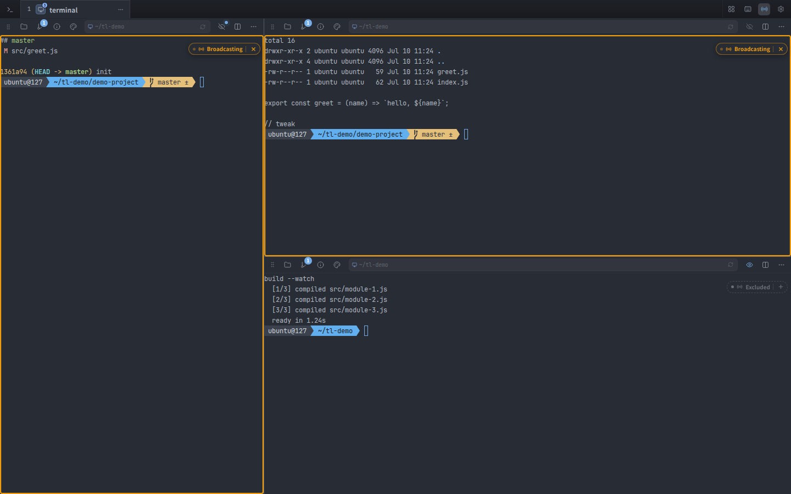
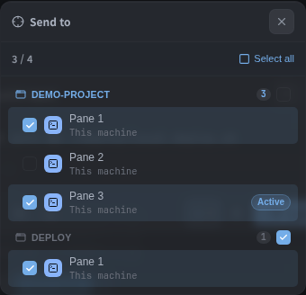
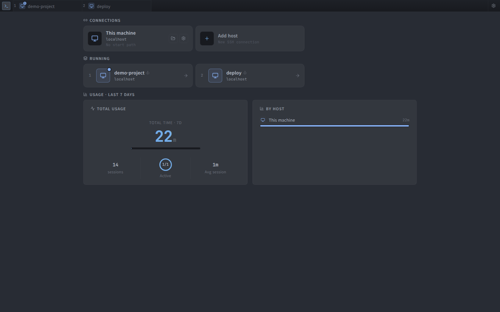
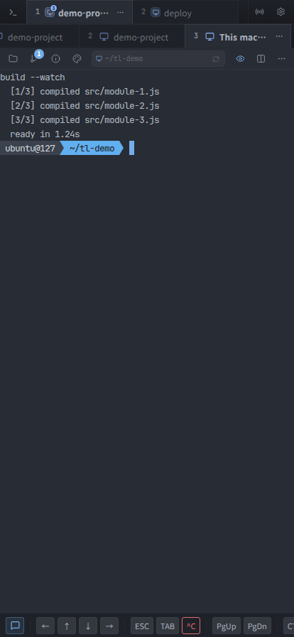
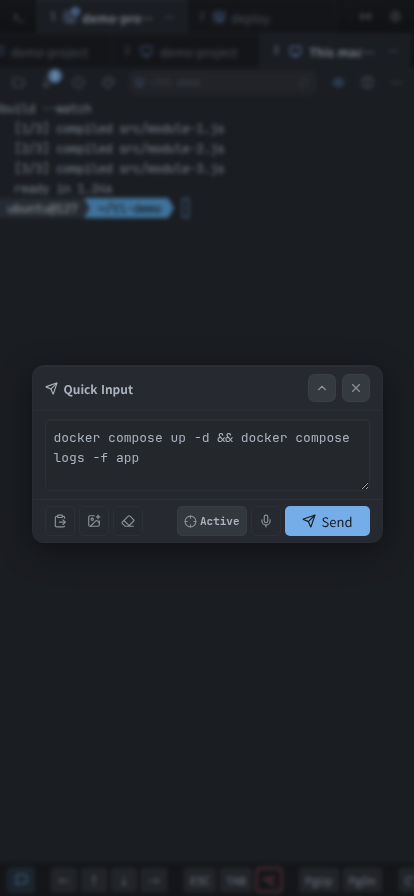

# Terminal List

🌐 [English](./README.md) | 🇰🇷 [한국어](./README.ko.md) | 🐳 GHCR Container | 🖥️ Host-native recommended

[](https://github.com/jshsakura/oc-terminal-list/actions/workflows/ghcr-publish.yml)
[](https://github.com/jshsakura/oc-terminal-list/pkgs/container/oc-terminal-list)
[](#license)

Fast, self-hosted web terminal for persistent `tmux` sessions, file browsing, SSH host management, and mobile-friendly server access.

**[▶ Live Demo](https://jshsakura.github.io/oc-terminal-list/#demo)** — scripted playback with sample hosts, no install, no signup, no real shell. See the [project site](https://jshsakura.github.io/oc-terminal-list/) for the full pitch and screenshots.

> Docker is supported for quick isolated deployment. **Host-native install is recommended** when you want the app to control the real host shell, host `tmux`, SSH tools, and local workspace directly.

```text
# Paste this into any AI coding assistant for guided setup
Install Terminal List from this repository and choose the best mode for my server:
https://github.com/jshsakura/oc-terminal-list

Prefer host-native systemd for full host integration.
Use GHCR Docker only if I want an isolated container terminal.
```

---

## Table of Contents

- [What it is](#what-it-is)
- [Screenshots](#screenshots)
- [Features](#features)
- [Install modes](#install-modes)
- [Quick Start: Docker / GHCR](#quick-start-docker--ghcr)
- [Recommended: Host-native systemd](#recommended-host-native-systemd)
- [Data model: Docker vs host-native](#data-model-docker-vs-host-native)
- [Configuration](#configuration)
- [First login and 2FA](#first-login-and-2fa)
- [Using the app](#using-the-app)
- [Operations](#operations)
- [Security model](#security-model)
- [Reverse proxy / HTTPS](#reverse-proxy--https)
- [Developer setup](#developer-setup)
- [Project structure](#project-structure)
- [Troubleshooting](#troubleshooting)
- [Roadmap](#roadmap)
- [License](#license)

---

## What it is

Terminal List is a browser-based terminal workspace for machines you own.

It combines:

- a web terminal backed by persistent host `tmux` sessions
- split panes with broadcast typing and per-pane opt-out
- a VS Code-style file browser and editor scoped to a workspace directory
- SSH host/key management
- single-admin login with optional TOTP 2FA and passkey (WebAuthn)
- voice input for hands-free command entry
- a responsive UI that works on desktop, tablet, and mobile

It is useful when you want a lightweight terminal dashboard that feels faster and more direct than notebook-style remote shells.

---

## Screenshots

### Split panes and Broadcast

Split a tab into as many panes as you need. Turn on **Broadcast** and every keystroke is mirrored to the other panes in the tab — each pane gets an amber border and a badge. Press the badge's `✕` to drop just that pane out of the broadcast (it then neither receives nor sends).



### Quick Input, targeted across tabs

Compose a command once, then pick exactly which terminals receive it. Panes are grouped by tab; tap a tab heading to select all of its panes at once. With nothing selected, the command goes to the focused pane.

<p align="center">
  
</p>

### Home dashboard



### Mobile

Splits collapse into sub-tabs, and a key toolbar supplies `Esc`, `Tab`, `Ctrl+C`, arrows, and paste. Quick Input sidesteps the Korean IME issues that plague mobile terminal input.

<p align="center">
  
  
</p>

---

## Features

| Area | Capability |
| --- | --- |
| Terminal | xterm.js terminal UI, persistent `tmux` sessions, reconnect-friendly WebSocket bridge, predictive echo (mosh-style local echo), restart a session in place (fresh shell, same cwd) |
| Panes | Split right/down, 2×2 grid, drag to resize, equalize (every pane gets equal area, even in nested splits), drag a pane out into its own tab |
| Broadcast | Mirror your typing to every pane in the tab; exclude individual panes on the fly |
| Quick Input | Compose a command and send it to any set of panes, grouped by tab; voice dictation (Web Speech API); per-terminal history with infinite scroll |
| Sessions | SQLite-backed session metadata and restoration |
| Files | Workspace-scoped file browser, Monaco editor, content search (ripgrep), upload into the selected folder, create/move/delete |
| Git | Per-pane change list and branch indicator for the pane's repository |
| Snippets | Saved commands, opened with `Ctrl+Shift+S` and run in the focused pane |
| SSH | Host and key management with encrypted secret storage |
| Auth | Initial admin setup, JWT sessions, optional TOTP 2FA, one-time backup codes, passkey (WebAuthn) |
| Vault | SSH passwords, private-key passphrases, and OTP secrets encrypted with `data/.vault-key` |
| UI | 59 themes, per-pane theme override, language switch (EN/KO), mobile sub-tabs and key toolbar, responsive layout |
| Performance | Gzip/Brotli, long-lived static asset cache, lazy loaded frontend chunks, Monaco idle prefetch, WebSocket batching, WebGL renderer |
| Deployment | GHCR Docker image, Compose example, systemd host-native service |

### MCP bridge for AI agents

`itl` is also exposed as an MCP server (`backend/cli/itl_mcp.py`) so AI coding agents inside a pane can drive siblings — send commands, read screens, wait for completion, send special keys — under the same scoped `ITL_TOKEN`.

```bash
# Claude Code (project-local)
claude mcp add itl -- python3 <repo>/backend/cli/itl_mcp.py

# opencode / other clients (mcpServers format)
{ "itl": { "command": "python3", "args": ["<repo>/backend/cli/itl_mcp.py"] } }
```

Env (`ITL_API` / `ITL_TOKEN` / `ITL_SESSION`) is inherited from the pane — never put `ITL_TOKEN` in the config.

---

## Install modes

| Mode | Best for | Terminal runs in | Data lives in | Recommendation |
| --- | --- | --- | --- | --- |
| **Host-native / systemd** | Real server control, host shell, host `tmux`, direct workspace access | The host | Host paths from `.env` | **Recommended** |
| **Docker / GHCR** | Quick trial, isolated deployment, simple rollback | The container | Mounted `./data` and `./workspace` | Supported |
| **Local dev** | Hacking on backend/frontend | Your dev shell | Local paths | Developers |

Why host-native is the primary mode: this project is a terminal tool. Container isolation is great for packaging, but it also means the shell, filesystem, SSH agent, and `tmux` server are container-scoped unless you intentionally mount and wire host resources.

---

## Quick Start: Docker / GHCR

Docker is the fastest way to try the app.

> Default port: **38822**. It avoids common development ports like `3000`, `5173`, `8000`, `8080`, and `8888`. Change it freely with `APP_PORT`.

### Option A: use the checked-in `compose.yml`

```bash
git clone https://github.com/jshsakura/oc-terminal-list.git
cd oc-terminal-list

docker compose up -d
docker compose logs -f backend
```

Open:

```text
http://localhost:38822
```

Use a different port:

```bash
# One-off
APP_PORT=9000 docker compose up -d

# Persistent for this checkout
echo "APP_PORT=9000" >> .env
docker compose up -d
```

### Option B: create a minimal Compose file

```bash
mkdir oc-terminal-list && cd oc-terminal-list

cat > compose.yml <<'EOF'
services:
  backend:
    image: ghcr.io/jshsakura/oc-terminal-list:latest
    container_name: oc-terminal-list
    ports:
      - "${APP_PORT:-38822}:${APP_PORT:-38822}"
    environment:
      - HOST=0.0.0.0
      - APP_PORT=${APP_PORT:-38822}
      - DB_PATH=/app/data/iterminallist.db
      - WORKSPACE_ROOT=/workspace
    volumes:
      - ./data:/app/data
      - ./workspace:/workspace
    restart: unless-stopped
EOF

docker compose up -d
```

### Docker behavior

- Web service listens on `${APP_PORT:-38822}`.
- The terminal shell is inside the container.
- App data is mounted from `./data` to `/app/data`.
- Editable workspace files are mounted from `./workspace` to `/workspace`.
- JWT signing key is generated at `data/.jwt-secret`; browser sessions use an HttpOnly cookie.
- Vault encryption key is generated as `/app/data/.vault-key`.

---

## Recommended: Host-native systemd

Use this when Terminal List should operate on the actual host environment.

### Prerequisites

- Linux host
- Python 3.12 recommended
- Node.js 20 recommended for frontend build
- `tmux`
- `sqlite3` CLI recommended for backup operations
- `bash` or your preferred host shell

Install OS packages on Debian/Ubuntu-like systems:

```bash
sudo apt-get update
sudo apt-get install -y python3 python3-venv nodejs npm tmux sqlite3
```

### Install

```bash
git clone https://github.com/jshsakura/oc-terminal-list.git
cd oc-terminal-list

cp .env.example .env
```

Edit `.env` for your host:

```bash
# Example host-native values
APP_PORT=38822
HOST=0.0.0.0
DB_PATH=/var/lib/iterminallist/iterminallist.db
VAULT_KEY_PATH=/var/lib/iterminallist/.vault-key
WORKSPACE_ROOT=/srv/iterminallist/workspace
TMUX_SOCKET_NAME=iterminallist-app
LOG_LEVEL=INFO
```

Create host-owned runtime directories:

```bash
sudo mkdir -p /var/lib/iterminallist /srv/iterminallist/workspace
sudo chown -R "$USER:$USER" /var/lib/iterminallist /srv/iterminallist/workspace
```

Install dependencies and build the frontend:

```bash
python3 -m venv .venv
.venv/bin/pip install -r backend/requirements.txt

cd frontend
npm install
npm run build
cd ..
```

Register the service:

```bash
# IMPORTANT: review deploy/iterminallist.service first.
# It contains host-specific User, Group, WorkingDirectory, EnvironmentFile, and ExecStart paths.
sudo cp deploy/iterminallist.service /etc/systemd/system/iterminallist.service
sudo systemctl daemon-reload
sudo systemctl enable --now iterminallist.service
```

Check status:

```bash
systemctl status iterminallist.service
journalctl -u iterminallist.service -f
```

Open:

```text
http://localhost:38822
```

> Full host operations guide: [`deploy/README.md`](./deploy/README.md)

---

## Data model: Docker vs host-native

Keep Docker and host-native data separate unless you are intentionally migrating.

| Mode | DB | Vault key | Workspace |
| --- | --- | --- | --- |
| Docker | `./data/iterminallist.db` mounted as `/app/data/iterminallist.db` | `./data/.vault-key` mounted as `/app/data/.vault-key` | `./workspace` mounted as `/workspace` |
| Host-native | `DB_PATH` in `.env` | `VAULT_KEY_PATH` in `.env` (or repo `data/.vault-key` default) | `WORKSPACE_ROOT` in `.env` |

Rules:

1. Back up `iterminallist.db` and `.vault-key` together.
2. Losing `.vault-key` makes encrypted SSH passwords, private-key passphrases, and OTP secrets unrecoverable.
3. Do not casually point Docker and systemd at the same `data/` directory. File ownership and vault-key mismatch can break secrets.
4. For migration, stop the app first, copy both DB and `.vault-key`, then restart in the target mode.

---

## Configuration

Core environment variables:

| Variable | Default / example | Description |
| --- | --- | --- |
| `HOST` | `0.0.0.0` | Bind address for FastAPI / uvicorn |
| `APP_PORT` | `38822` | Web service port |
| `DB_PATH` | `/var/lib/iterminallist/iterminallist.db` or `/app/data/iterminallist.db` | SQLite database path |
| `VAULT_KEY_PATH` | `/var/lib/iterminallist/.vault-key` or `/app/data/.vault-key` | Fernet master key path for encrypted secrets |
| `WORKSPACE_ROOT` | `/srv/iterminallist/workspace` or `/workspace` | Root directory exposed in the file browser |
| `TMUX_SOCKET_NAME` | `iterminallist-app` | Dedicated `tmux -L` socket namespace |
| `TMUX_HISTORY_LIMIT` | `100000` | tmux scrollback/history limit |
| `LOG_LEVEL` | `INFO` | Python logging level |
| `RELOAD` | `false` for production | Uvicorn reload flag |
| `TRUST_PROXY_HEADERS` | `0` | Trust `X-Forwarded-*` headers only when behind a trusted reverse proxy |
| `ENABLE_CSP` | `1` | Send the default Content-Security-Policy header |

Security keys:

- Do **not** put JWT signing keys in `.env`.
- JWT signing key is generated and stored at `data/.jwt-secret` by default, or `JWT_SECRET_PATH` if set.
- Vault master key is stored at `VAULT_KEY_PATH` if set; otherwise the app default is `data/.vault-key` under the project root. It must be backed up with the DB.
- JWT rotation command is available for host-native installs:

```bash
.venv/bin/python backend/rotate_jwt.py --confirm
sudo systemctl restart iterminallist.service
```

---

## First login and 2FA

1. Open `http://localhost:38822` or your configured domain.
2. The initial setup screen appears when no admin exists.
3. Create the admin account:
   - username: at least 3 characters
   - password: at least 8 characters; 12+ recommended
4. Log in.
5. Optional but recommended: enable TOTP 2FA in **Settings → 2-step authentication**.

2FA flow:

1. Click **Enable 2FA**.
2. Scan the QR code with Google Authenticator, Microsoft Authenticator, 1Password, Bitwarden, or any RFC 6238-compatible app.
3. Enter the 6-digit code.
4. Store the 10 one-time backup codes safely. They are not shown again.

---

## Using the app

### Terminal

- Open a terminal from the Home dashboard ("This machine") or from any registered SSH host.
- Reconnect after browser refresh; the backend reattaches to persistent `tmux` sessions.
- Rename a tab from its `⋯` menu; close a tab to end the sessions inside it.
- Use the mobile toolbar keys for `Esc`, `Tab`, `Ctrl+C`, arrows, and paste on touch devices.
- **Reload terminal** (pane `…` menu) remounts the view and re-attaches to the *same* shell — its PATH, shell hash, and running processes are untouched.
- **Restart session** (pane `…` menu) kills the tmux session and opens a fresh shell **at the same directory**. Use it when a just-installed binary isn't on `PATH` yet. Everything running inside dies, so it asks for confirmation first.

### Splits and Broadcast

- Split a pane right (`Ctrl+\`) or down (`Ctrl+Shift+\`), or pick a 2×2 grid from the tab menu.
- Drag the divider to resize. **Equalize panes** (grid icon in the tab bar) restores equal area to every pane — including nested splits, where a naive "half each" would leave inner panes at half size.
- **Broadcast** (antenna icon) mirrors your typing to every pane in the tab. Broadcasting panes get an amber border and a badge; press the badge's `✕` to exclude one pane, `+` to bring it back.
- An excluded pane neither receives broadcast input nor sends its own, so a stray keystroke there cannot leak into the others.
- Turning Broadcast off clears the exclusions, so it always starts with everyone included.

### Quick Input, voice, and targeting

- Open Quick Input from the tab bar (keyboard icon), the mobile toolbar, or `Ctrl+Shift+Enter`.
- It sidesteps mobile IME problems: type the whole command, then send it once.
- Type directly or tap the mic to dictate via the Web Speech API.
- Press the crosshair button to choose **which** terminals receive the command. Panes from every open tab are listed, grouped by tab — tap a tab heading to select all of its panes. With nothing selected, the command goes to the focused pane.
- The **Command History** panel (eye icon) shows per-terminal history with infinite scroll. Click an entry to insert it at the cursor.

### File browser

- Browse under `WORKSPACE_ROOT` only.
- Open and edit files in the built-in Monaco editor; search file contents with ripgrep.
- Create, move, rename, and delete workspace entries.
- Upload lands in the folder you have selected. With nothing selected it falls back to the folder you have navigated into, then to the folder of the file open in the editor.
- Open a terminal in a selected folder.

### Passkey / WebAuthn

- In **Settings → Security**, register a passkey (Face ID, Touch ID, hardware key).
- On subsequent logins, use the passkey instead of a password.
- TOTP 2FA and password login remain available as fallbacks.

### Settings

- Theme selection: 59 themes (Catppuccin, Tokyo Night, Dracula, Gruvbox, Nord, Rosé Pine, Solarized, GitHub, …), overridable per pane.
- Text contrast: brighten low-contrast palettes for legibility, or show the theme colors as-is.
- Language: Korean / English.
- Font size and family, separately for desktop and mobile.
- Terminal auto-scroll behavior, smooth scroll, scroll sensitivity.
- Predictive echo (mosh-style local echo), auto-disabled in editors and password prompts.
- TOTP 2FA, backup-code management, and passkey registration.

### Keyboard shortcuts

| Shortcut | Action |
| --- | --- |
| `Ctrl+Shift+Enter` | Quick Input |
| `Ctrl+Shift+P` | Command palette |
| `Ctrl+Shift+S` | Snippet palette |
| `Ctrl+P` | Quick open files |
| `Ctrl+T` | New tab |
| `Ctrl+W` | Close tab |
| `Ctrl+1` … `Ctrl+9` | Switch to tab N |
| `Ctrl+\` | Split right |
| `Ctrl+Shift+\` | Split down |
| `Ctrl+,` | Settings |
| `Ctrl+Shift+F` | Find in terminal |

On macOS, use `Cmd` in place of `Ctrl`.

---

## Operations

### Service commands

```bash
sudo systemctl restart iterminallist.service
sudo systemctl stop iterminallist.service
sudo systemctl start iterminallist.service
journalctl -u iterminallist.service -f
```

### Docker commands

```bash
docker compose ps
docker compose logs -f backend
docker compose restart backend
docker compose pull
docker compose up -d
```

### Backup

Host-native example:

```bash
DEST=/backup/iterminallist-$(date +%Y%m%d-%H%M)
mkdir -p "$DEST"

sqlite3 /var/lib/iterminallist/iterminallist.db ".backup $DEST/iterminallist.db" 2>/dev/null \
  || cp /var/lib/iterminallist/iterminallist.db "$DEST/iterminallist.db"

cp /var/lib/iterminallist/.vault-key "$DEST/.vault-key"
chmod 600 "$DEST/.vault-key"
```

Docker example:

```bash
DEST=./backup/iterminallist-$(date +%Y%m%d-%H%M)
mkdir -p "$DEST"

sqlite3 ./data/iterminallist.db ".backup $DEST/iterminallist.db" 2>/dev/null \
  || cp ./data/iterminallist.db "$DEST/iterminallist.db"

cp ./data/.vault-key "$DEST/.vault-key"
chmod 600 "$DEST/.vault-key"
```

### Restore

Host-native:

```bash
sudo systemctl stop iterminallist.service
cp /backup/iterminallist-YYYYMMDD-HHMM/iterminallist.db /var/lib/iterminallist/iterminallist.db
cp /backup/iterminallist-YYYYMMDD-HHMM/.vault-key /var/lib/iterminallist/.vault-key
chmod 600 /var/lib/iterminallist/.vault-key
sudo systemctl start iterminallist.service
```

Docker:

```bash
docker compose down
cp ./backup/iterminallist-YYYYMMDD-HHMM/iterminallist.db ./data/iterminallist.db
cp ./backup/iterminallist-YYYYMMDD-HHMM/.vault-key ./data/.vault-key
chmod 600 ./data/.vault-key
docker compose up -d
```

---

## Security model

| Control | Behavior |
| --- | --- |
| Admin auth | Single-admin setup flow, password hashing with bcrypt/passlib |
| Session auth | JWT access token in an HttpOnly cookie; signing key generated at `data/.jwt-secret` |
| 2FA | TOTP with one-time backup codes |
| Secret storage | Fernet-encrypted vault values using `data/.vault-key` |
| File access | Server validates paths and confines file operations to `WORKSPACE_ROOT` |
| API access | Auth-protected API endpoints |

Recommendations:

1. Enable TOTP 2FA.
2. Put the app behind HTTPS for anything beyond local-only use.
3. Keep `APP_PORT` firewalled if using a reverse proxy.
4. Back up DB and `.vault-key` together.
5. Do not commit `.env`, `data/`, DB files, or `.vault-key`.

---

## Reverse proxy / HTTPS

Example Nginx configuration:

```nginx
server {
    listen 80;
    server_name terminal.example.com;

    location / {
        proxy_pass http://127.0.0.1:38822;
        proxy_http_version 1.1;
        proxy_set_header Host $host;
        proxy_set_header X-Real-IP $remote_addr;
        proxy_set_header X-Forwarded-For $proxy_add_x_forwarded_for;
        proxy_set_header X-Forwarded-Proto $scheme;
    }

    location /ws/ {
        proxy_pass http://127.0.0.1:38822;
        proxy_http_version 1.1;
        proxy_set_header Upgrade $http_upgrade;
        proxy_set_header Connection "Upgrade";
        proxy_set_header Host $host;
        proxy_read_timeout 3600s;
        proxy_send_timeout 3600s;
    }
}
```

Enable HTTPS with Certbot:

```bash
sudo apt-get install -y certbot python3-certbot-nginx
sudo certbot --nginx -d terminal.example.com
sudo certbot renew --dry-run
```

---

## Developer setup

### Run both backend and frontend

```bash
python run.py
```

Options:

```bash
python run.py --backend
python run.py --frontend
python run.py --no-restart
```

### Manual backend

```bash
cd backend
pip install -r requirements.txt
DB_PATH=../data/iterminallist.db APP_PORT=8000 python3 main.py
```

### Manual frontend

```bash
cd frontend
npm install
npm run dev
```

Vite dev server defaults to `5173` and proxies `/api` and `/ws` to `localhost:8000` unless `VITE_BACKEND_HOST` / `VITE_BACKEND_PORT` are set.

### Tests and build

```bash
# Frontend tests
cd frontend
npx vitest run

# Frontend production build -> backend/static
npm run build

# Backend tests
cd ../backend
pytest
```

### Docker image build

```bash
docker build -t ghcr.io/jshsakura/oc-terminal-list:latest .
docker compose config --quiet
docker compose up -d
```

### GHCR publishing

The workflow at `.github/workflows/ghcr-publish.yml` publishes to:

```text
ghcr.io/jshsakura/oc-terminal-list
```

Triggers:

- push to `main` or `master`
- tags matching `v*.*.*`
- manual `workflow_dispatch`

Generated tags include `latest` for the default branch, semantic version tags for releases, and `sha-*` tags.

---

## Project structure

```text
oc-terminal-list/
├── backend/                    # FastAPI backend
│   ├── main.py                 # API, WebSocket bridge, static serving
│   ├── auth_manager.py         # Admin auth, JWT, 2FA flow
│   ├── sqlite_storage.py       # SQLite persistence
│   ├── tmux_manager.py         # tmux session management
│   ├── vault.py                # encrypted secret storage
│   ├── requirements.txt
│   └── tests/
├── frontend/                   # React + Vite frontend
│   ├── src/
│   ├── public/
│   ├── package.json
│   └── vite.config.js          # builds into backend/static
├── deploy/
│   ├── README.md               # host-native operations guide
│   └── iterminallist.service   # systemd unit template/example
├── compose.yml                 # GHCR Compose example
├── Dockerfile                  # multi-stage frontend + backend image
├── .dockerignore
├── .env.example
├── run.py                      # development supervisor
└── README.md
```

---

## Troubleshooting

### Port already in use

Docker:

```bash
APP_PORT=9000 docker compose up -d
```

Persist it:

```bash
echo "APP_PORT=9000" >> .env
docker compose up -d
```

Host-native:

```bash
# edit .env
APP_PORT=9000

sudo systemctl restart iterminallist.service
```

### Docker container does not start

```bash
docker compose ps
docker compose logs backend
docker compose config
```

### systemd service fails

```bash
journalctl -u iterminallist.service -n 100 --no-pager
systemctl status iterminallist.service
```

Common causes:

- `deploy/iterminallist.service` still contains the wrong `User`, `Group`, or path.
- `.env` points `DB_PATH` or `WORKSPACE_ROOT` to a directory the service user cannot write.
- `tmux` is missing.
- frontend was not built into `backend/static`.

### Login succeeds but immediately logs out

JWT signing key may have rotated. Sign in again; the server will clear/reissue the session cookie.

### Vault decrypt errors

The DB and `.vault-key` do not match. Restore both from the same backup set, or re-register affected SSH/host secrets.

### Reset Docker data

```bash
docker compose down
rm -rf ./data ./workspace
mkdir -p ./data ./workspace
docker compose up -d
```

---

## Roadmap

- [ ] install.sh guided host-native installer
- [ ] PyPI / pipx packaging after CLI and static asset layout are cleaned up
- [ ] multi-user support
- [ ] session sharing
- [ ] terminal recording/replay
- [ ] plugin system
- [ ] native mobile companion apps

---

## Related docs

- [`deploy/README.md`](./deploy/README.md) — systemd operations, JWT rotation, vault key handling, backup/restore
- [GHCR package](https://github.com/jshsakura/oc-terminal-list/pkgs/container/oc-terminal-list)
- [GitHub Issues](https://github.com/jshsakura/oc-terminal-list/issues)

---

## License

MIT License.

---

